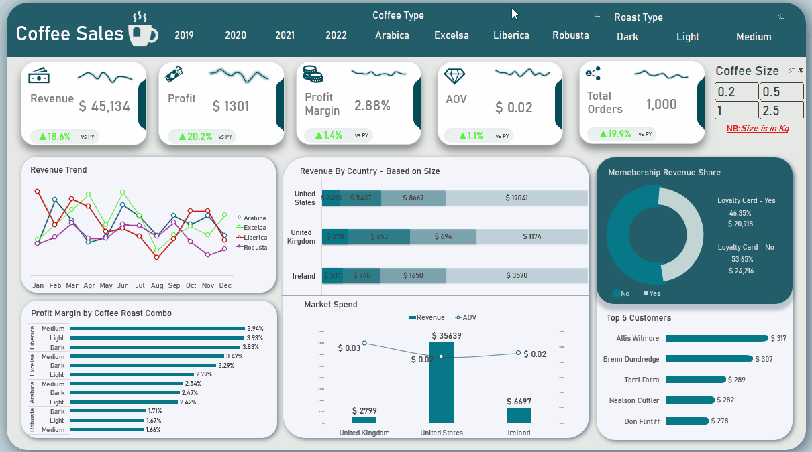

# ☕ Brewing Insights: Coffee Sales Performance Analysis

> *Does your best-selling coffee make you the most money? Not always.*

*[📥 Download / View the Interactive Dashboard](your-onedrive-or-download-link)*

---

## 📌 Project Objective

This project analyzes retail coffee sales data across three markets (US, Ireland, UK) to move beyond surface-level revenue reporting and answer the questions that actually matter to a business: which products are worth pushing, which customers are worth targeting, and when does demand actually peak?

Raw order history was transformed into a fully interactive Excel dashboard built to challenge assumptions — not just confirm them.

> **Dataset credit:** Data sourced from [Mo Chen's YouTube channel](https://www.youtube.com/@mochen-data). The analysis, dashboard design, and business framing are original.

---

## 📂 Repository Structure

```
├── data/
│   ├── orders.csv
│   ├── customers.csv
│   └── products.csv
├── dashboard/
│   └── coffee_sales.xlsx
├── LICENSE
├── README.md
└── dashboard.gif
```

---

## 🧹 Data Preparation

The raw dataset spanned three relational tables (orders, customers, products) which were modelled and cleaned before any analysis began.

- **Data Modelling:** Used Power Pivot to build relationships across the three tables — enabling cross-table calculations without VLOOKUP chains.
- **DAX Measures:** Created calculated measures for Revenue, Profit, Profit Margin %, Average Order Value (AOV), and Year-over-Year (YoY) growth directly in the data model.
- **Format Standardisation:** Cleaned order dates, standardised roast type and size labels, and formatted all currency fields consistently.
- **Data Integrity:** Resolved duplicate entries and inconsistent pricing fields. Email was intentionally excluded — present in the raw data but irrelevant to the analysis scope.

---

## 📊 The Dashboard



> For full interactivity and formatting, download the Excel workbook via the link at the top.

The dashboard is built around six charts, each designed to answer a specific business question. Four connected slicers (Coffee Type, Roast Type, Size, Order Year) allow stakeholders to interrogate every visual dynamically.

### The Story the Dashboard Tells

**"Are we growing the right way, with the right customers?"**

| # | Chart | Business Question Answered |
|---|-------|---------------------------|
| 1 | Revenue Trend by Coffee Type *(Line)* | Which coffee types are driving growth — and which are losing ground? |
| 2 | Profit Margin by Coffee Type + Roast *(Clustered Bar)* | Are our bestselling products actually our most profitable? |
| 3 | Country Revenue vs. Average Order Value *(Bar + Line Combo)* | Which market spends the most per order — volume or value? |
| 4 | Loyalty vs. Non-Loyalty: Revenue Share *(Doughnut)* | Is the loyalty program capturing high-value customers, or rewarding people who'd buy anyway? |
| 5 | Sales by Package Size Across Countries *(Stacked Bar, normalised %)* | Do different markets prefer different pack sizes? |
| 6 | Top Performing Customers *(Bar)* | Which customer brings in the most revenue? |

---

## 🔍 Key Findings

**1. High revenue ≠ high profit — and the gap reveals opportunity**
Excelsa generates the most total revenue ($12.3K) with Excelsa-Light as the top combo ($4.8K). But Liberica quietly outperforms three other coffee types on profit, with the Liberica-Light combination making the most profit ($179) despite low sales volume. Robusta sits at the bottom on both metrics. Light roast leads on revenue and profit across all types except Arabica, where Medium roast tops both.

**2. Loyalty card holders are not your highest-value customers**
Non-loyalty customers generate more total revenue and profit — outspending loyalty holders by over $3,000. On a per-transaction basis, loyalty card holders actually buy less. The one edge the loyalty segment holds: a marginally higher profit margin (0.11%). The program may be attracting casual buyers rather than converting high-value ones.

**3. The US dominates volume; UK wins on margin**
The US contributes 78.96% of revenue and 77.82% of profit — but the UK holds the highest profit margin at 3.09%, despite the lowest totals. Each market has a distinct preference: Arabica-Medium leads in the US, Liberica-Dark in Ireland, and Excelsa-Dark in the UK. Liberica is the most profitable coffee type across both Ireland (3.87%) and the UK (3.79%).

**4. Seasonality is real — and August is a consistent weak point**
March is the strongest month for revenue and profit across the dataset; August is the weakest. November showed consistent sales and profit growth across 2019–2021. Sales dipped in August across all three years (a likely temperature effect on hot beverage demand). No month showed uniform decline, but sharp post-peak dips appeared in June 2019 and March 2022.

**5. The biggest pack drives the most profit — but customers aren't buying it**
The 2.5kg size generates the highest revenue and profit and carries the best margin. Yet it is not the most frequently purchased size. Customers default to smaller sizes despite the value sitting in the largest pack — a classic upsell gap.

---

## 💡 Recommendations

**1. Use the decoy effect to push 2.5kg**
Price the 1kg size closer to the 2.5kg to make the larger pack feel like the obvious choice. The margin difference justifies a small COGS increase per transaction. The goal: migrate customers from the high-volume, low-margin 0.5kg toward the lower-volume, high-margin 2.5kg.

**2. Fight the August slump with cold product diversification**
August's consistent dip likely reflects hot weather reducing demand for hot coffee. Introducing cold brew or iced coffee options, paired with a "Cold Drink Happy Hour" loyalty event, directly targets the seasonal gap rather than discounting existing products.

**3. Prioritise underexposed products by market**
Each market has a high-potential coffee type that's underperforming relative to its margin:
- 🇺🇸 US → Underexposed: Liberica
- 🇮🇪 Ireland → Underexposed: Excelsa
- 🇬🇧 UK → Underexposed: Liberica

Targeted promotions or menu placement in each region could unlock margin without requiring new products.

---

## 🛠️ Tools & Features Used

| Tool / Feature | Purpose |
|----------------|---------|
| Microsoft Excel | End-to-end analysis and dashboard |
| Power Pivot | Relational data modelling across 3 tables |
| DAX | Custom measures: Revenue, Profit, Margin %, AOV, YoY |
| Pivot Tables & Pivot Charts | Dynamic aggregation by type, region, and date |
| Slicers (×4) | Cross-chart filtering by Coffee Type, Roast Type, Size, Order Year |
| Donut Chart | Loyalty segment breakdown |

---

## 👤 Author

**Jerrem**
 | Data Analyst 

[](https://github.com/Jerrem-Asante-Gyimah)
[](https://www.linkedin.com/in/jerrem-asante-gyimah/)
